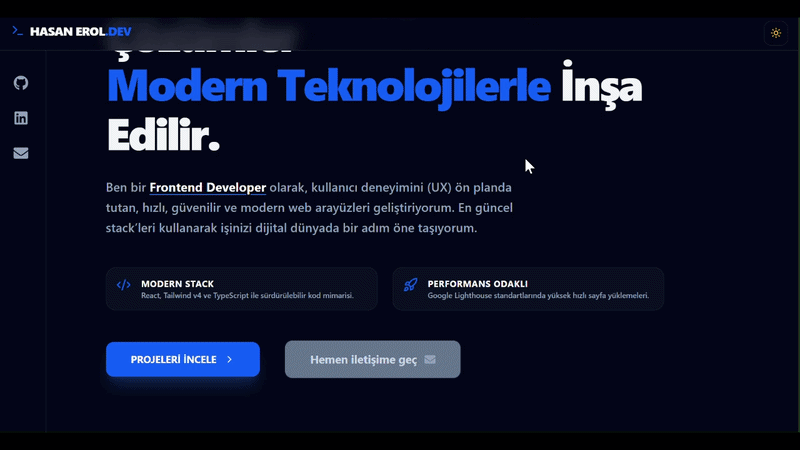

# 🚀 Hasan Erol | Full-Stack Developer

Modern web teknolojileriyle geliştirdiğim projeleri ve teknik yetkinliklerimi sergilediğim kişisel portfolyo web sitesi.

---

## 🛠️ Kullandığım Teknolojiler

- React
- Vite
- Tailwind CSS
- Node.js
- MongoDB
- TypeScript

---

## 📂 Öne Çıkan Projeler

### 🛒 MERN Shop
Tam kapsamlı e-ticaret platformu.
Ürün yönetimi, sepet sistemi ve JWT tabanlı kullanıcı yetkilendirme içerir.

### 🛡️ Not Sakla (Secure Vault)
MERN Stack ve TypeScript ile geliştirilmiş güvenli not uygulaması.
Tip güvenliği ve modern mimari odaklıdır.

### 📦 Context Store
React Context API kullanarak "prop drilling" problemini çözen,
merkezi state yönetimi üzerine kurulu teknik bir çalışma.

### 📱 QR Menu System
Restoranlar için dinamik QR kodlu dijital menü sistemi.
Modern, hızlı ve temassız kullanıcı deneyimi sunar.

---

## 🚀 Kurulum

Projeyi kendi bilgisayarında çalıştırmak için:

```bash
# Repoyu klonla
git clone https://github.com/HasanEROL1/hasan-erol-portfolio.git

# Klasöre gir
cd hasan-erol-portfolio

# Bağımlılıkları yükle
npm install

# Projeyi başlat
npm run dev
```

---

## 👨‍💻 Geliştirici

**Hasan Erol**

- GitHub: https://github.com/HasanEROL1
- LinkedIn: https://www.linkedin.com/in/hasan-erol-dev
